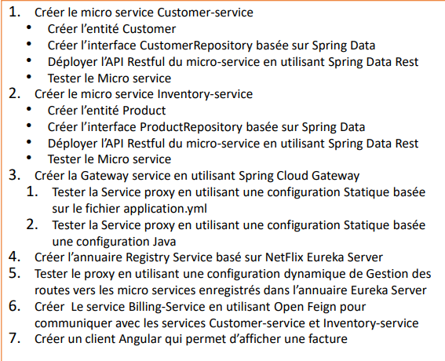

## Activité pratique N°2 : Architectures Micro-services avec Spring cloud 

####  énoncé : 


####  Architecture : 


####  Micro-services :  
* Customer-service :
  pour ce service on aura besoin de ces dependances :
  ```bash
  <dependencies>
        <dependency>
            <groupId>org.springframework.boot</groupId>
            <artifactId>spring-boot-starter-data-rest</artifactId>

        </dependency>
        <dependency>
            <groupId>org.springframework.boot</groupId>
            <artifactId>spring-boot-starter-web</artifactId>
        </dependency>
        <dependency>
            <groupId>org.springframework.cloud</groupId>
            <artifactId>spring-cloud-starter-netflix-eureka-client</artifactId>
        </dependency>

        <dependency>
            <groupId>org.springframework.boot</groupId>
            <artifactId>spring-boot-devtools</artifactId>
            <scope>runtime</scope>
            <optional>true</optional>
        </dependency>
        <dependency>
            <groupId>com.h2database</groupId>
            <artifactId>h2</artifactId>
            <scope>runtime</scope>
        </dependency>
        <dependency>
            <groupId>org.projectlombok</groupId>
            <artifactId>lombok</artifactId>
            <optional>true</optional>
        </dependency>
        <dependency>
            <groupId>org.springframework.boot</groupId>
            <artifactId>spring-boot-starter-test</artifactId>
            <scope>test</scope>
        </dependency>
        <dependency>
            <groupId>org.springframework.boot</groupId>
            <artifactId>spring-boot-starter-data-jpa</artifactId>
        </dependency>
    </dependencies>
  ```
Pour la configuration dans le fichier application.properties on demarre le service dans le port 8081 
et on met discovery en true pour que le service peut s'enregistrer automatiquement dans eureka:
```bash
server.port=8081
spring.application.name=customer-service
spring.datasource.url=jdbc:h2:mem:DB_Customer
spring.cloud.discovery.enabled=true```
* eureka-service


