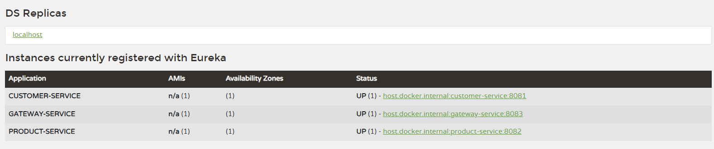
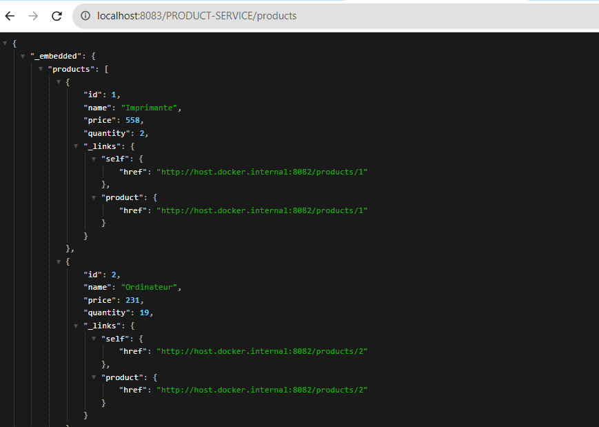

## Activité pratique N°2 : Architectures Micro-services avec Spring cloud 

####  énoncé : 


####  Architecture : 


####  Micro-services :  
* Customer-service :  
  pour ce service on aura besoin de ces dependances :
  ```bash
  <dependencies>
        <dependency>
            <groupId>org.springframework.boot</groupId>
            <artifactId>spring-boot-starter-data-rest</artifactId>

        </dependency>
        <dependency>
            <groupId>org.springframework.boot</groupId>
            <artifactId>spring-boot-starter-web</artifactId>
        </dependency>
        <dependency>
            <groupId>org.springframework.cloud</groupId>
            <artifactId>spring-cloud-starter-netflix-eureka-client</artifactId>
        </dependency>

        <dependency>
            <groupId>org.springframework.boot</groupId>
            <artifactId>spring-boot-devtools</artifactId>
            <scope>runtime</scope>
            <optional>true</optional>
        </dependency>
        <dependency>
            <groupId>com.h2database</groupId>
            <artifactId>h2</artifactId>
            <scope>runtime</scope>
        </dependency>
        <dependency>
            <groupId>org.projectlombok</groupId>
            <artifactId>lombok</artifactId>
            <optional>true</optional>
        </dependency>
        <dependency>
            <groupId>org.springframework.boot</groupId>
            <artifactId>spring-boot-starter-test</artifactId>
            <scope>test</scope>
        </dependency>
        <dependency>
            <groupId>org.springframework.boot</groupId>
            <artifactId>spring-boot-starter-data-jpa</artifactId>
        </dependency>
    </dependencies>
  ```
Pour la configuration dans le fichier application.properties on demarre le service dans le port 8081 
et on met discovery en true pour que le service peut s'enregistrer automatiquement dans eureka:
```bash
server.port=8081
spring.application.name=customer-service
spring.datasource.url=jdbc:h2:mem:DB_Customer
spring.cloud.discovery.enabled=true
```
puis on remplie la base de donnees avec quelques enregistrement : 
```bash
    @Bean
    CommandLineRunner start(CustomerRepository customerRepository,
                            RepositoryRestConfiguration repositoryRestConfiguration
    ){
        repositoryRestConfiguration.exposeIdsFor(Customer.class);
        return args->{

            Stream.of("hamid", "abdo", "karima", "ihssan", "khalid", "mouad", "samira").forEach(name -> {

                customerRepository.save(new Customer(name,name+"@gmail.com"));

            });

            customerRepository.findAll().forEach(System.out::println);
        };
```
* inventory-service :
  Pour ce service, la meme procedure que Customer service.
* eureka-service :

   Pour le dependences de ce service on aura besoin seulement que de eureka server
  ```bash
   <dependency>
            <groupId>org.springframework.cloud</groupId>
            <artifactId>spring-cloud-starter-netflix-eureka-server</artifactId>
        </dependency>
   ```
  pour la configuration de ce service
```bash
   #par défault 8761
   server.port=8761
   # dont register server itself as a client.
   eureka.client.fetch-registry=false
   # Does not register itself in the service registry.
   eureka.client.register-with-eureka=false
 ```
si on connecte vers eureka service via le lien suivant http://localhost:8761 
on trouve que les services sont bien enregistrees dans eureka
 

* getway-service :
 voici les dependances de la getway 
```bash
  <dependencies>
        <dependency>
            <groupId>org.springframework.boot</groupId>
            <artifactId>spring-boot-starter-actuator</artifactId>
        </dependency>
        <dependency>
            <groupId>org.springframework.cloud</groupId>
            <artifactId>spring-cloud-starter-gateway</artifactId>
        </dependency>
        <dependency>
            <groupId>org.springframework.cloud</groupId>
            <artifactId>spring-cloud-starter-netflix-eureka-client</artifactId>
        </dependency>

        <dependency>
            <groupId>org.springframework.boot</groupId>
            <artifactId>spring-boot-starter-test</artifactId>
            <scope>test</scope>
        </dependency>
    </dependencies>
```
pour la configuration du getway 
```bash
spring:
  cloud:
    gateway:
      routes:
        - id: r1
          uri: http://localhost:8081/
          predicates:
            - Path = /customers/**
        - id: r2
          uri : http://localhost:8082/
          predicates:
            - Path= /products/**
      globalcors:
        corsConfigurations:
          '[/**]':
            allowedOrigins: "http://localhost:4200/*"
            allowedHeaders: "*"
            allowedMethods:
              - GET
              - POST
              - PUT
              - DELETE
    discovery:
      enabled: true

server:
  port: 8083
```
aussi
```bash
    //=>Méthode statique: je connais les routes
    //@Bean
    RouteLocator gatewayRoutes(RouteLocatorBuilder builder){ //configurer les rootes
        return builder.routes()
//                .route(r->r.path("/customers/**").uri("http://localhost:8081/"))
//                .route(r->r.path("/products/**").uri("http://localhost:8082/"))
                .route(r->r.path("/customers/**").uri("lb://CUSTOMER-SERVICE"))
                .route(r->r.path("/products/**").uri("lb://PRODUCT-SERVICE"))
                .build();

    }

    //=>Méthode dynamique:
    //  - je ne connais pas les route
    //  - à chaque fois que tu reçoit une requete, regarde dans l'URL de la requete tu vas trouvé le nom du Micro Service
    @Bean
    DiscoveryClientRouteDefinitionLocator dynamicRoutes(
            ReactiveDiscoveryClient rdc,
            DiscoveryLocatorProperties dlp){

        return new DiscoveryClientRouteDefinitionLocator(rdc,dlp);

    }
```
si on essaye d'acceder aux services via la getway
 
