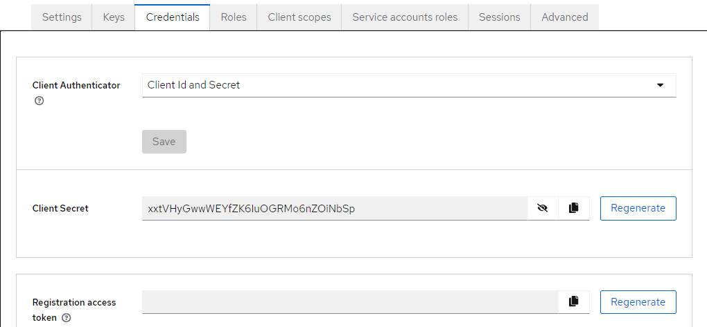
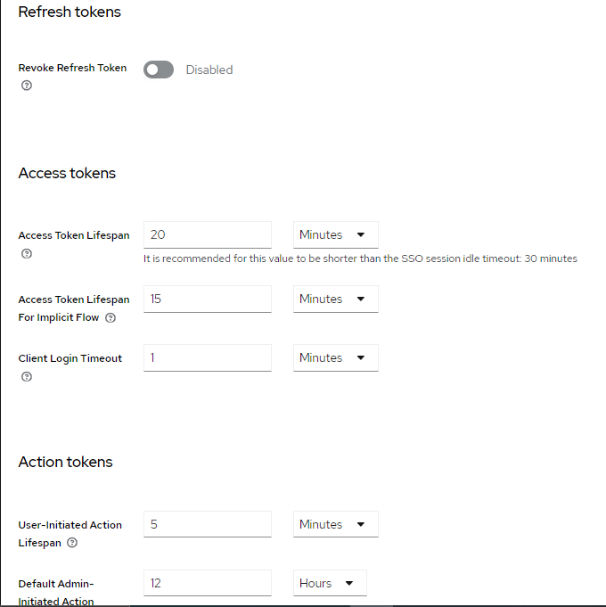

## Activité Pratique N°4 :  Sécurité des Systèmes Distribués


####  Architecture : 
 

####  Partie 1 : 

##### 1. Télécharger Keycloak 19
depuis le site officel de keycloak on telecharge la derniere version [Download](https://www.keycloak.org/)  

##### 2. Démarrer Keycloak 
on le demare par la commande suivante : 
```bash
kc.bat start-dev
```
##### 3. Créer un compte Admin 
 
puis on fait connecter au compte admin  
 
##### 4. Créer une Realm 
* wallet-realm

 
##### 5. Créer un client à sécuriser 
 
 
##### 6. Créer des utilisateurs 
* user1 :
 

* user2 : 

 
 
##### 7. Créer des rôles
* USER :

 

* ADMIN :
  
 

##### 8. Affecter les rôles aux utilisateurs 
dans cette partie on va assigner le role ADMIN & USER au user "bouargalne" et USER au user "hamid" 
* user "bouargalne" :

 

* user "hamid" :
  
 

##### 9. Avec PostMan :
   - Tester l'authentification avec le mot de passe
    
    
     
   - Analyser les contenus des deux JWT Access Token et Refresh Token
    
     
   - Tester l'authentification avec le Refresh Token
    
    
   - Tester l'authentification avec Client ID et Client Secret 
    
    
    
    
   - Changer les paramètres des Tokens Access Token et Refresh Toke
    

 ####  Partie 2 : 
 * securisation de e-bank-service :
 la configuration de service dans le fichier .properties est comme suite 
 ```bash
  server.port=8084
  spring.datasource.url=jdbc:h2:mem:currency-deposit
  spring.h2.console.enabled=true
  keycloak.realm=wallet-realm
  keycloak.auth-server-url=http://localhost:8080
  keycloak.ssl-required=none
  keycloak.bearer-only=true
  keycloak.resource=walle
```
et dans le realm il faut desactiver le SSL 
Pour KeycloakAdapterConfig 
```bash
@Configuration
public class KeycloakAdapterConfig {

    @Bean
    KeycloakSpringBootConfigResolver springBootConfigResolver() {
        return new KeycloakSpringBootConfigResolver();
    }
}
```
et ausssi 
```bash
@KeycloakConfiguration
@EnableGlobalMethodSecurity(prePostEnabled = true)
public class SecurityConfig extends KeycloakWebSecurityConfigurerAdapter {

    @Override
    protected SessionAuthenticationStrategy sessionAuthenticationStrategy() {
        return new RegisterSessionAuthenticationStrategy(new SessionRegistryImpl());
    }

    @Override
    protected void configure(AuthenticationManagerBuilder auth) throws Exception {
        auth.authenticationProvider(keycloakAuthenticationProvider());
    }

    @Override
    protected void configure(HttpSecurity http) throws Exception {
        super.configure(http);
        http.authorizeRequests()
                .antMatchers("/h2-console/**").permitAll();
        http.csrf().disable();
        http.headers().frameOptions().disable();
        http.authorizeRequests()
                .anyRequest()
                .authenticated();
    }

}
```
et dans le controller on specefie les role 
```bash
@RestController
@CrossOrigin("*")
public class EBankRestController {
    @Autowired
    private EBankServiceImpl eBankService;

    @PostMapping("/currencyTransfer")
    @PreAuthorize("hasAuthority('ADMIN')")
    public CurrencyTransferResponse currencyTransfer(@RequestBody NewWalletTransferRequest request) {
        return this.eBankService.newWalletTransaction(request);
    }

    @GetMapping("/currencyDeposits")
    @PreAuthorize("hasAuthority('USER')")
    public List<CurrencyDeposit> currencyDepositList() {
        return eBankService.currencyDeposits();
    }
}
```
