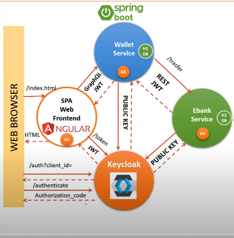
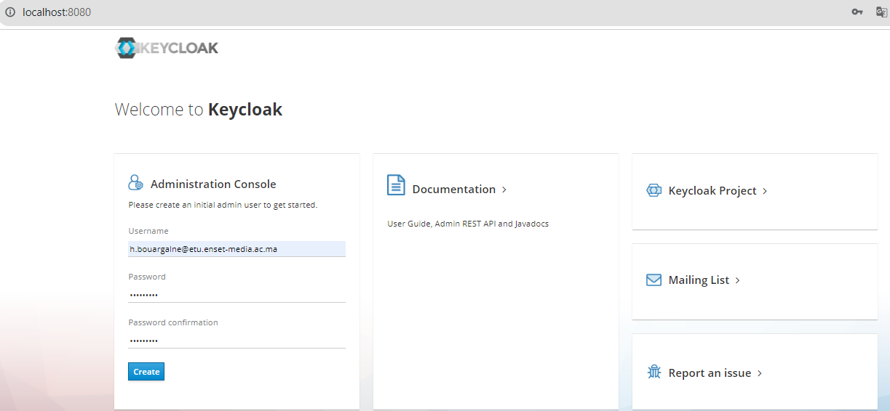

## Activité Pratique N°4 :  Sécurité des Systèmes Distribués


####  Architecture : 
 

####  Partie 1 : 

###### 1. Télécharger Keycloak 19
depuis le site officel de keycloak on telecharge la derniere version [Download](https://www.keycloak.org/)  

###### 2. Démarrer Keycloak 
on le demare par la commande suivante : 
```bash
kc.bat start-dev
```
###### 3. Créer un compte Admin 
 
###### 4. Créer une Realm
###### 5. Créer un client à sécuriser
###### 6. Créer des utilisateurs
###### 7. Créer des rôles
###### 8. Affecter les rôles aux utilisateurs
###### v9. Avec PostMan :
    - Tester l'authentification avec le mot de passe
    - Analyser les contenus des deux JWT Access Token et Refresh Token
    - Tester l'authentification avec le Refresh Token
    - Tester l'authentification avec Client ID et Client Secret
    - Changer les paramètres des Tokens Access Token et Refresh Toke
