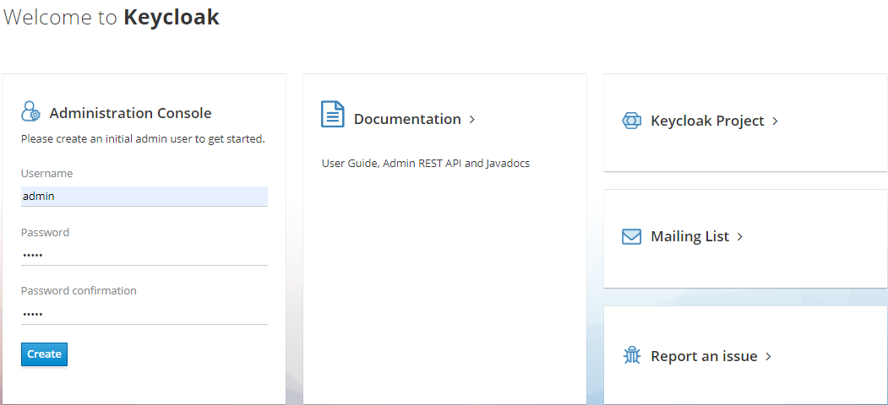
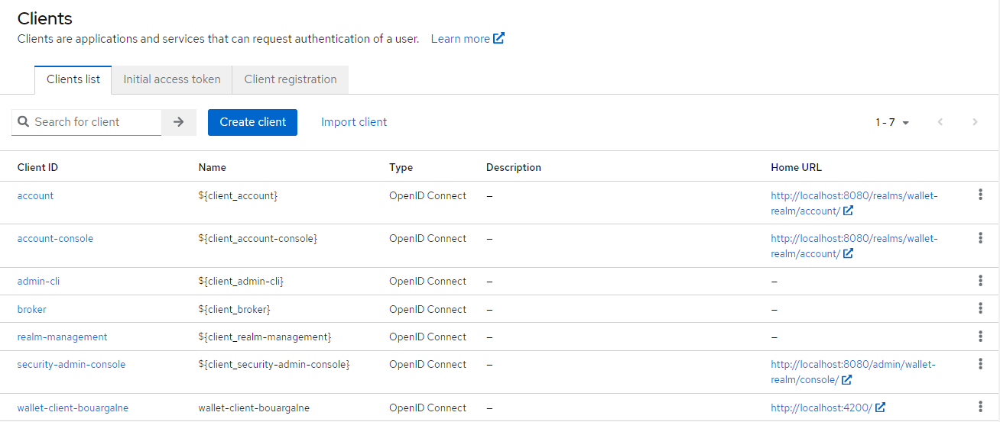

## Activité Pratique N°4 :  Sécurité des Systèmes Distribués


####  Architecture : 
 

####  Partie 1 : 

##### 1. Télécharger Keycloak 19
depuis le site officel de keycloak on telecharge la derniere version [Download](https://www.keycloak.org/)  

##### 2. Démarrer Keycloak 
on le demare par la commande suivante : 
```bash
kc.bat start-dev
```
##### 3. Créer un compte Admin 
 
puis on fait connecter au compte admin  
 
##### 4. Créer une Realm 
* wallet-realm

 
##### 5. Créer un client à sécuriser 
 
 
##### 6. Créer des utilisateurs 
* user1 :
 

* user2 : 

 
 
##### 7. Créer des rôles
* USER :

 

* ADMIN :
  
 

##### 8. Affecter les rôles aux utilisateurs 
dans cette partie on va assigner le role ADMIN & USER au user "bouargalne" et USER au user "hamid" 
* user "bouargalne" :

 

* user "hamid" :
  
 

##### 9. Avec PostMan :
   - Tester l'authentification avec le mot de passe
    
    
     
   - Analyser les contenus des deux JWT Access Token et Refresh Token
    
     
   - Tester l'authentification avec le Refresh Token
    
    
   - Tester l'authentification avec Client ID et Client Secret
    
    
    
    
   - Changer les paramètres des Tokens Access Token et Refresh Toke
    
     
